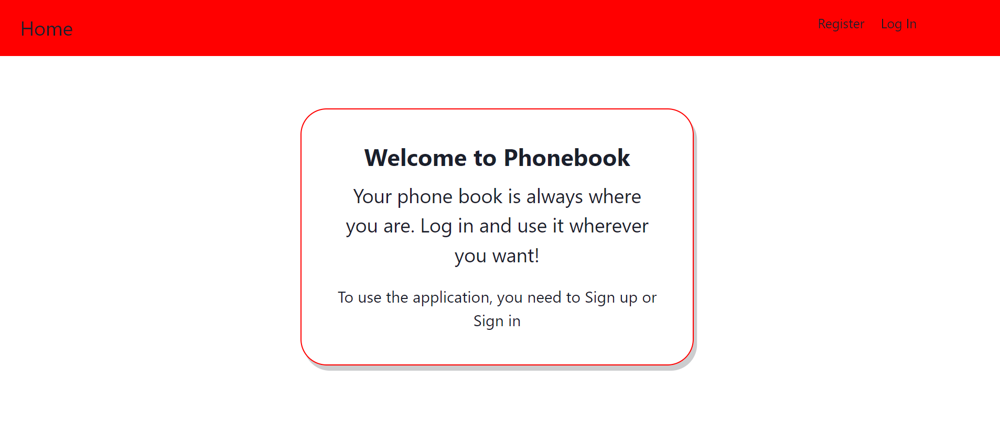
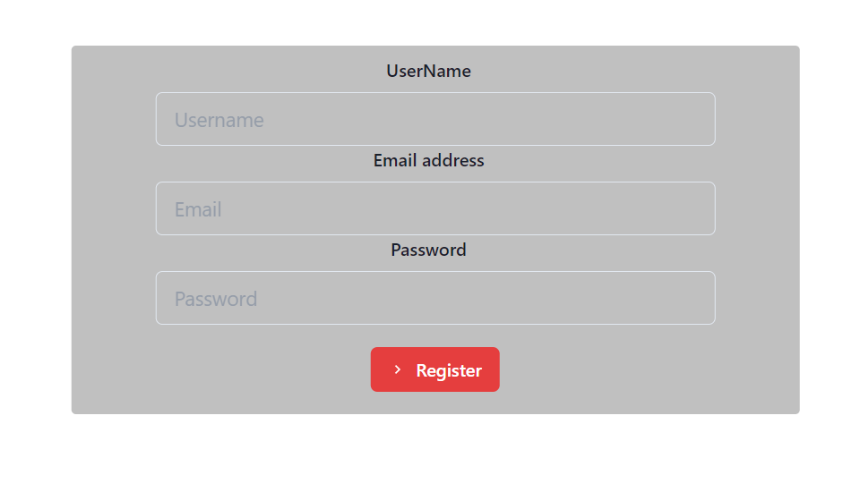
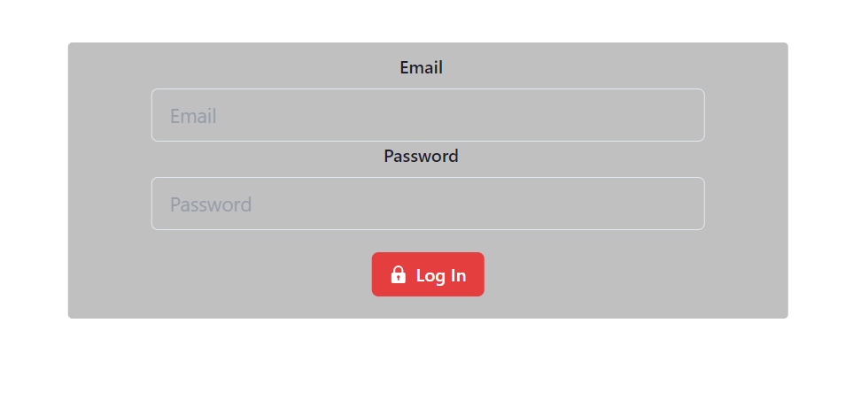
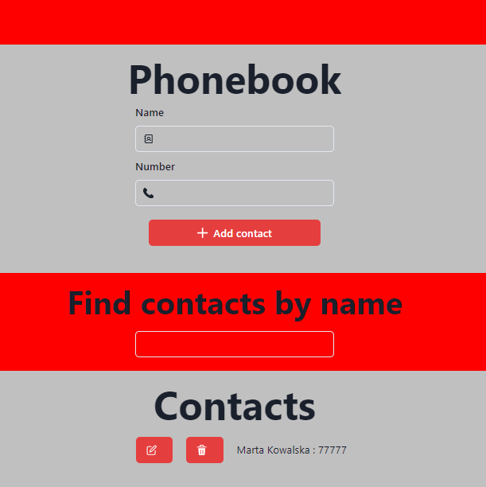

# Phonebook v6

Phonebook v8 is React application in which we can add contacts. The filter used allows you to search for contacts by name. The delete button allows you to remove added contacts from the list.

# Installation
## Clone repository:
```shell
git clone [repository-url]
```
## Change to the project directory:
```shell
cd [repository-name]

```
## Install and start:
```shell
npm install
npm run dev
npm start
```
### The application should run at:
http://localhost:3000

## How it should look like?
### Welcome:


### Register:


### LogIn:


### Phonebook:
